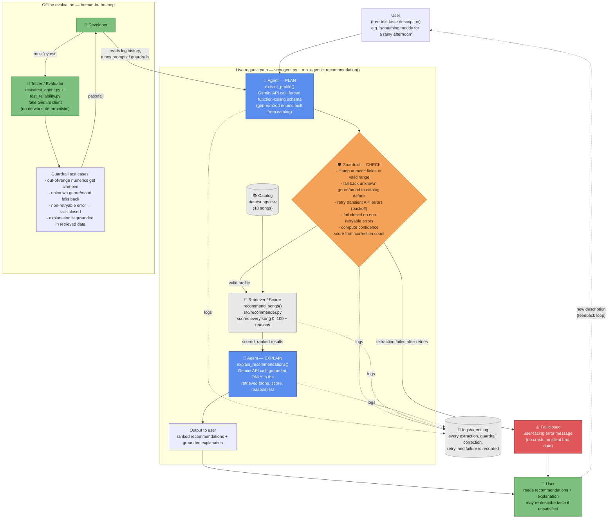

# Agent Architecture — Conversational Taste Agent

System diagram for the agentic pipeline in [`src/agent.py`](../src/agent.py)
(`run_agentic_recommendation()`). GitHub renders the Mermaid block below
inline; open it in the [Mermaid Live Editor](https://mermaid.live) if your
viewer doesn't.

**Legend:** 🤖 agent (Gemini API call) · 🛡️ guardrail/validator ·
🔎 retriever/scorer · 📚/📝 data stores · 👤 human checkpoint ·
🧪 automated tester · ⚠️ failure path.

## Reading the diagram

- **Input → process → output:** a free-text description enters at the top,
  flows through PLAN (extraction) → CHECK (guardrails) → the retriever
  (scoring against `data/songs.csv`) → EXPLAIN (grounded write-up), and
  exits as a ranked list plus explanation.
- **Where AI acts vs. where the system checks it:** the two 🤖 nodes are the
  only places Gemini is called. Every other node is deterministic code —
  in particular, the 🛡️ guardrail node sits *between* the two agent calls
  and can reject or repair the agent's output before it ever reaches the
  scoring engine.
- **Where humans/testing are involved:**
  - **Live path:** the 👤 user is both the source of input and the final
    reviewer of output — if the recommendations miss, they re-describe
    their taste, which re-enters the loop (dashed feedback edge).
  - **Failure path:** if extraction can't be validated even after retries,
    the guardrail fails closed (⚠️) with a clear message instead of passing
    bad data downstream.
  - **Offline path:** a separate, human-run test suite
    (`tests/test_agent.py` + `tests/test_reliability.py`) exercises the
    guardrail logic and the resulting confidence score against a fake
    client — no network calls — so a developer can verify guardrail
    correctness and iterate on prompts without touching the live API.
    `test_reliability.py` prints a real pass-rate and confidence summary
    (`pytest -v -s`), not just pass/fail.
